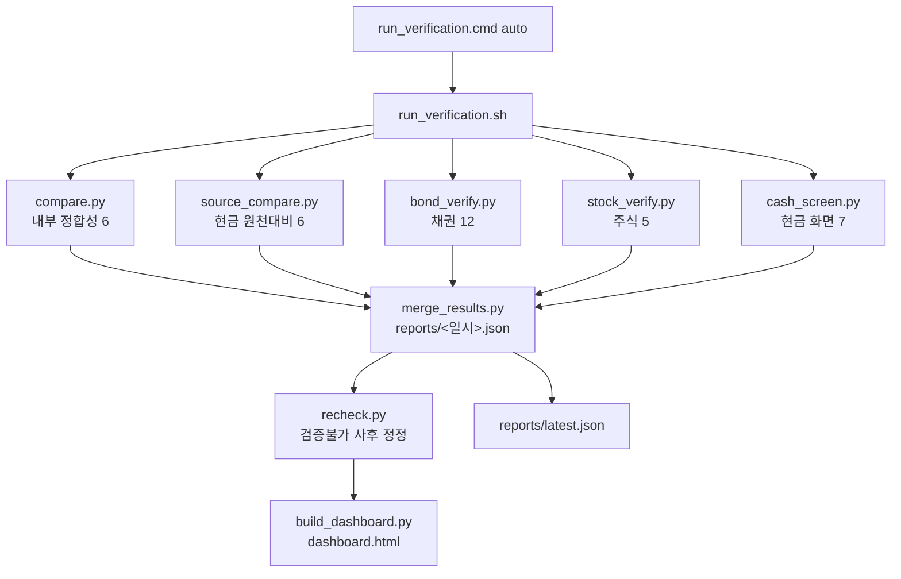

# 구조와 데이터 흐름

## 검증 대상은 '세 층'이다

```
 [사내 SamsApi]  ──수집──→  [Supabase]  ──화면 계산──→  [포털 화면 숫자]
   (자금일보)                (저장 데이터)                 (렌더링 결과)
        ▲                        ▲                            ▲
        │ ① 원천 대비             │ ② 내부 정합성               │ ③ 화면 정합성
        │ source_compare         │ compare                    │ cash_screen
        │ bond_verify            │ (지사합·통화별합)            │ (node 로 화면 실행)
        └────────────────────────┴────────────────────────────┘
                    검증기는 세 층을 각각 따로 본다
```

| 층 | 왜 따로 보나 |
| --- | --- |
| ① 원천 대비 | 수집 단계에서 값이 빠지거나 잘못 환산되는 것을 잡는다 |
| ② 내부 정합성 | 외부 API 없이도 항상 돌아간다. 사내망이 끊긴 날의 최소 방어선 |
| ③ 화면 정합성 | **저장 데이터가 멀쩡해도 화면이 틀릴 수 있다.** 2026-08-21 장애가 그 사례 |

!!! danger "2026-08-21 장애 — 이 시스템의 형태를 결정한 사건"
    현금 화면의 ①상단 총 보유현금·②통화별 합계는 **최신일 환율**로,
    ③계열사별 합계·④자금 추이 그래프는 **그 날 환율**로 환산하고 있었습니다.
    오늘 기준일만 맞고 과거 기준일은 전부 어긋났습니다(차이가 백억 원 단위까지 벌어짐).

    저장된 데이터는 멀쩡했기 때문에 내부 정합성 검사로는 잡히지 않았고,
    기존 검사가 모두 **'최신 1행'만** 보고 있었기 때문에 구조적으로도 검출이 불가능했습니다.

    → 그래서 `cash_screen.py` 는 ⓐ 화면 코드를 실제로 실행하고 ⓑ **전 기준일**을 훑습니다.

## 실행 파이프라인

`run_verification.sh` 가 순서대로 부릅니다. 각 단계는 단독 실행도 가능합니다.



각 검사는 **부분 결과**를 `reports/_*.json` 으로 내고, `merge_results.py` 가 하나로 합칩니다.
실행 시작 시 `rm -f reports/_*.json` 으로 이전 실행 잔재를 지우므로,
중간에 죽은 검사의 옛 결과가 섞여 들어가지 않습니다.

## 공통 모듈 (`checks/common/`)

| 모듈 | 역할 | 핵심 |
| --- | --- | --- |
| `samsapi.py` | 사내 SamsApi 독립 커넥터 | 수집기 `samsapi.js` 를 **재사용하지 않는다**(원칙 ②). 호출 간 `0.35초` 간격 + 429/5xx 시 `1.5s → 4.0s` 재시도 |
| `compare.py` | 허용 오차 기반 수치 비교 | `exact` / `absolute` / `relative` 세 방식. 판정은 전적으로 이 함수 |
| `result.py` | 표준 결과 레코드 생성 | `make_result()` — 스키마를 어기면 `assert` 로 즉시 실패 |
| `snapshot.py` | 판정 근거 보존 | `{snap_dir}/{metric_id}_{role}.json` |
| `http.py` | JSON 페치 | 토큰은 **환경변수 이름**으로만 받음. `file://` 지원(오프라인 픽스처) |
| `extract.py` | 응답에서 값 추출 | JSONPath 유사 문법 |
| `errors.py` | 예외 정의 | `FetchError` · `ExtractError` · `ComputeError` · `ConfigError` |
| `timeutil.py` | 시간 처리 | UTC 계산 / Asia/Seoul 표시 |

!!! note "예외는 대부분 FAIL 이 아니라 UNVERIFIABLE 로 매핑된다"
    `FetchError`(네트워크·타임아웃·HTTP 오류·JSON 파싱 실패)와 `ExtractError`(응답 구조 변경)는
    **대시보드의 결함이 아닙니다.** 원칙 ③에 따라 검증불가로 분류합니다.

## 속도제한(429) 대비

사내 API 는 짧은 시간에 요청이 몰리면 `HTTP 429` 로 거절합니다.
수집기(`refreshCashFromApi`)와 검증기가 **같은 API 키**를 쓰므로 시각이 겹치면 서로를 밀어냅니다.

- 수집 09:00 / 검증 09:10 으로 **10분 분리**
- 검증기 자체 완충: `SAMSAPI_CALL_GAP_SEC`(기본 0.35초), `SAMSAPI_RETRY_WAITS`(기본 `1.5,4.0`)
  — 둘 다 **환경변수로 조정 가능**합니다. 운영 중 코드 수정 없이 늦출 수 있게 한 것입니다.
- 그래도 거절당하면 검증불가 → [사후 재검증](recheck.md)이 이어받습니다.
