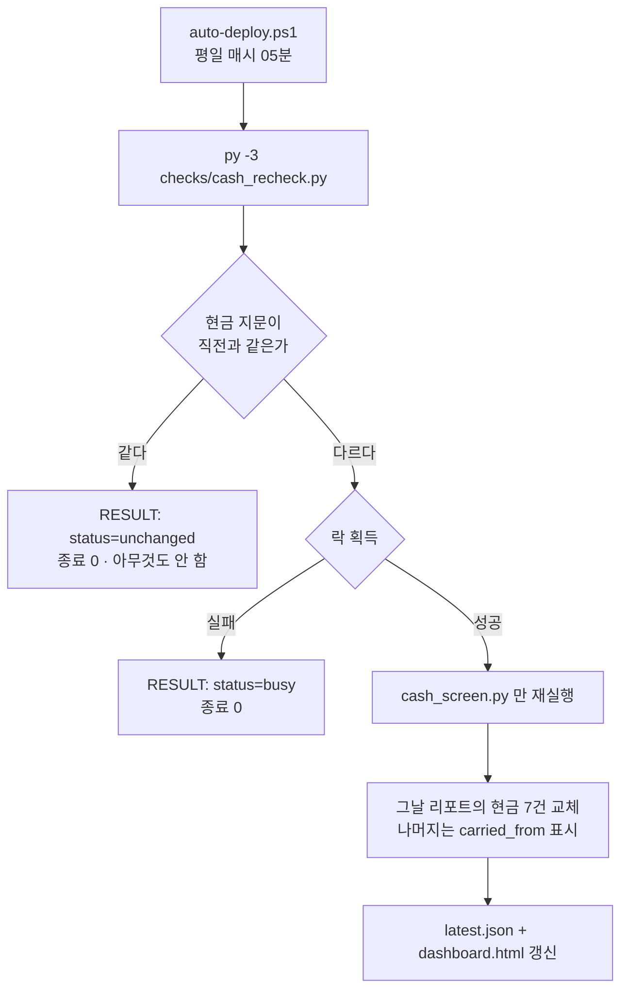

# 사후 재검증과 현금 재검증

이름이 비슷하지만 **목적이 다른 두 장치**입니다.

| | `recheck.py` (사후 재검증) | `cash_recheck.py` (현금 재검증) |
| --- | --- | --- |
| 언제 | 매 검증 실행 끝 | 평일 매시 05분 (자동배포가 호출) |
| 왜 | 그때 **못 물어본** 항목을 되살리려고 | 그 사이 **값이 바뀐** 현금을 다시 보려고 |
| 대상 | 지난 14일치의 `UNVERIFIABLE` | 오늘 현금 7건 |
| 결과 | 과거 리포트를 정정 | 오늘 리포트를 갱신 |

---

## `recheck.py` — 사후 재검증

### 되살릴 수 있는 구조적 이유

- 검증기는 원천을 부르기 **전에** 포털 값을 스냅샷으로 저장한다(원칙 ④).
  원천이 거절당해도 포털 쪽 증거는 남는다.
- SamsApi 는 **과거일 조회**(`from_date`/`to_date`)를 지원한다.

→ 「그날 저장된 포털 값」 vs 「그날 기준일로 지금 다시 부른 원천」 = **그날의 검증을 그대로 재현**

### 정정할 때 지키는 세 가지

1. 포털 값은 **그때 저장된 스냅샷**을 쓴다. 지금 화면값을 쓰면 그 사이 갱신분과 비교하게 되어
   그날의 검증이 아니게 된다.
2. 원천은 **그날 기준일**로 조회한다.
3. 비교 로직은 **당일 검증과 똑같은 함수**를 쓴다. 두 벌로 갈라지면 정정값이 당일 판정과 달라진다.

### 되살릴 수 있는 항목

`check_id` 접두어로 핸들러가 정해집니다.

| 접두어 | 핸들러 |
| --- | --- |
| `metrics.bond_purchase_` · `metrics.bond_price_` · `metrics.bond_holdings_` | `recheck_bonds` |
| `metrics.source_vs_dashboard_` · `metrics.cash_on_hand_` | `recheck_source` |

한 번 호출로 **그 회사의 관련 지표가 함께** 정정됩니다.
매입금액은 통화별 지표라 `bond_purchase_sinokor_USD` 처럼 뒤에 통화가 붙는데,
회사 키로 바로 안 맞으면 통화 접미어를 한 번 떼고 다시 찾습니다.

되살릴 수 없는 것: **주식 현재가 교차검증 · 현금 화면 검사**
(포털 쪽 원자료가 스냅샷에 남지 않음). 사유를 적고 그대로 둡니다.

### 옵션

| 옵션 | 기본 | 설명 |
| --- | --- | --- |
| `--days` | `14` | 며칠 전 리포트까지 훑을지 |
| `--report` | — | 특정 리포트 파일만 |
| `--max-attempts` | `5` | |
| `--summary-out` | — | 요약 JSON 저장 경로 |
| `--dry-run` | | 파일을 바꾸지 않고 결과만 출력 |
| `--quiet` | | |

```bat
py checks\recheck.py --days 30 --dry-run
```

!!! note "정정은 숨기지 않는다"
    원래 판정(`original_status`)과 정정 시각(`rechecked_at`)을 함께 기록하고,
    다시 조회한 원천도 그 실행의 스냅샷 폴더에 보존합니다.
    `run_verification.sh` 에서는 `|| true` 로 감싸 **재검증 실패가 검증 실행을 실패로 만들지 않게** 합니다.

---

## `cash_recheck.py` — 현금 재검증 {: #cash }

### 왜 필요한가 (2026-09-04)

전체 검증은 하루 한 번(09:10)만 돕니다. 그런데 현금 데이터는 낮·저녁에 **회사별로 따로** 들어옵니다.
09:10 에는 3사가 모두 '전일 이월(잠정)'이라 아무 문제가 없다가,
한 회사만 당일 마감이 끝나면(그 회사만 당일 환율로 환산) 계열 화면이 3사 합과 어긋났습니다.

→ 자동배포가 매시간 스냅샷을 새로 만들 때, **현금 값이 실제로 바뀌었으면** 현금 검사만 다시 돌립니다.

### 동작



### 현금 지문(fingerprint)

현금 화면 결과를 좌우하는 것**만** 골라 SHA-256 으로 해시합니다.

| 포함 | 제외 |
| --- | --- |
| 회사별 기준일(`dates`) · 통화별 잔액(`cash`) · 환율(`fx`) | 주식 현재가 · 채권 시세처럼 매시간 바뀌지만 현금 화면과 무관한 값 |
| 지사합계(`branchTotals`) · 잠정여부(`cashProvisional`, `cashRealAsOf`) | `branchTotals.generatedAt` (값이 같아도 매 실행 바뀌는 도장) |
| 은행 명세 `cash-detail/{회사}.json` 전체 | |
| **화면 코드 2벌** — `홈페이지배포/app.js`, `데이터수집서버/public/app.js` | |

!!! danger "화면 코드가 두 벌인 것을 잊지 마십시오"
    포털 화면 코드는 배포본과 서버본 **두 곳**에 있습니다.
    지문에 둘 다 넣는 이유는, 한쪽만 고쳐도 화면이 달라질 수 있기 때문입니다.
    (같은 이유로 화면을 고칠 때는 양쪽을 함께 고쳐야 합니다.)

### 종료 코드와 출력

| 코드 | 뜻 |
| --- | --- |
| `0` | 정상 (변경 없음 / 재검증 통과 / 다른 검증이 실행 중) |
| `1` | 현금 검사에 `FAIL` 있음 |
| `2` | 재검증 실행 자체가 실패 (지문 계산 실패, `cash_screen.py` 실행 실패) |

표준출력에는 호출자(PowerShell)가 읽을 **ASCII 한 줄**만 냅니다 — `RESULT: status=unchanged` 등.
콘솔 한글 깨짐과 무관하게 판정을 읽기 위해서입니다.
사람이 읽는 기록은 `logs/cash-recheck.log`(UTF-8)에 남습니다.

### 옵션

| 옵션 | 설명 |
| --- | --- |
| `--force` | 지문이 같아도 재검증한다 |
| `--no-notify` | 알림을 보내지 않는다 |

### 동시 실행 방지

`logs/.cash-recheck.lock` 디렉터리로 락을 잡습니다.
20분이 지난 락은 죽은 것으로 보고 무시합니다(`LOCK_STALE_SEC`).
전체 검증과 겹쳐도 리포트가 깨지지 않게 하기 위한 장치입니다.
