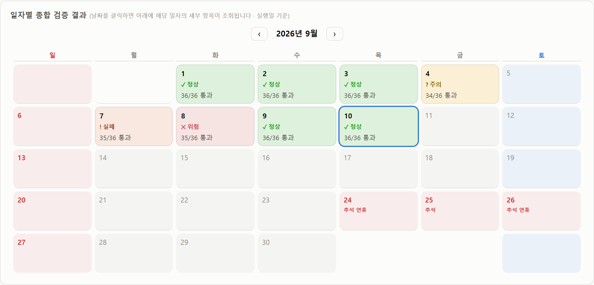
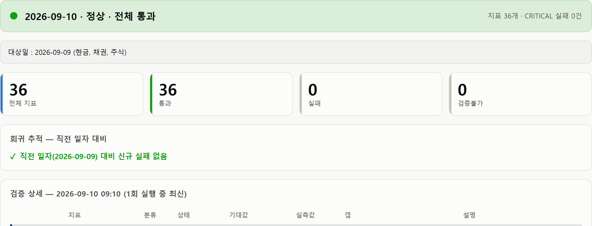
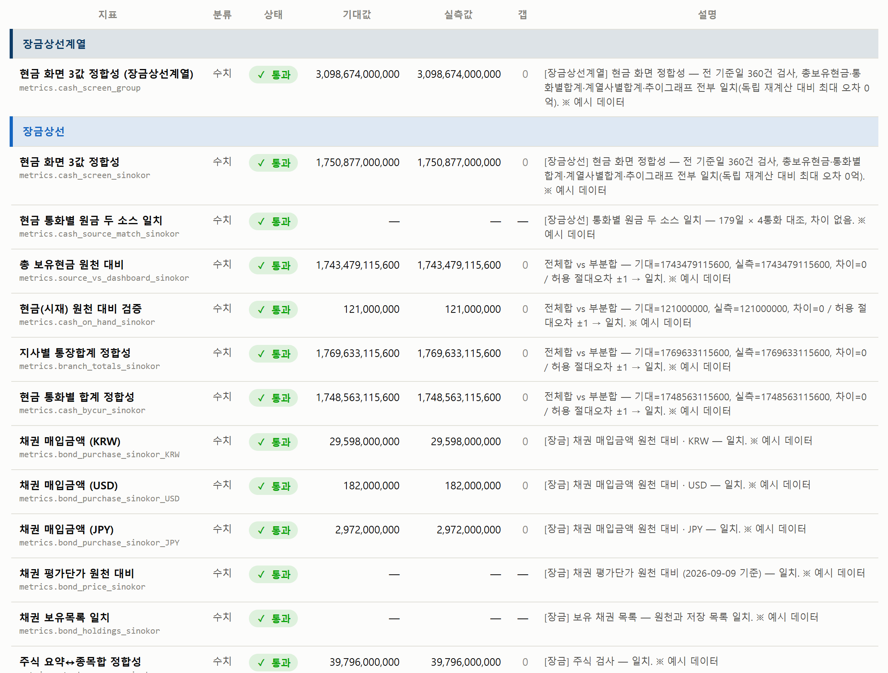
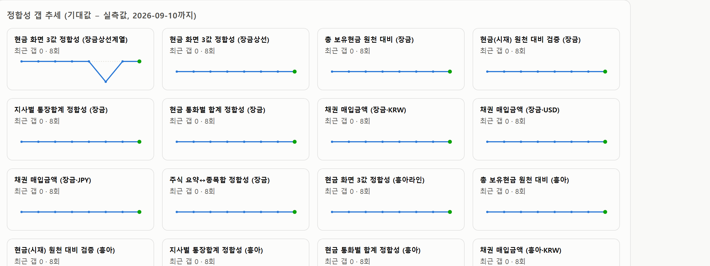

# 5. 결과 확인 방법

## 5.1 검증 대시보드 보는 법

**파일 위치 : `reports\dashboard.html`**

더블클릭하면 브라우저에서 열립니다. 검증 결과가 이 파일 안에 통째로 들어 있어
**인터넷 연결이 필요 없고, 회사 밖으로 아무것도 나가지 않습니다.**
화면은 위아래 두 층입니다 — 위쪽은 달력, 아래쪽은 선택한 날의 상세.

!!! info "아래 캡처의 숫자는 예시입니다"
    이 문서는 공개 문서라 실제 보유 금액을 싣지 않습니다.
    캡처는 **진짜 대시보드 생성기에 지어낸 숫자를 먹여 만든 것**이라
    화면 모양·색·배치는 실물 그대로이고 금액만 가짜입니다
    (`tools/make_demo_dashboard.py`). 실제 수치는 사내 대시보드에서 확인하십시오.

### ① 위쪽 — 일자별 종합 검증 결과 (달력)

*날짜 칸마다 그날의 종합 판정과 통과 건수가 표시된다. 파란 테두리가 선택된 날짜이며,
열면 최신 일자가 자동으로 선택되어 있다.*

날짜 칸마다 종합 판정이 **색 · 아이콘 · 글자** 세 가지로 함께 표시됩니다.
색만으로 뜻을 전달하지 않으므로 색 구분이 어려워도 글자로 읽을 수 있습니다.

| 표시 | 색 | 아이콘 | 뜻 |
| --- | --- | --- | --- |
| 정상 | 초록 | ✓ | 그날 검사한 항목 전부 통과 |
| 주의 | 노랑 | ? | 검증불가가 있음 (값이 틀린 것은 아님) |
| 실패 | 주황 | ! | 실패 항목이 있으나 CRITICAL 은 아님 |
| 위험 | 빨강 | ✕ | CRITICAL 실패 — 즉시 확인 필요 |

- 칸 아래의 「36/36 통과」는 그날 검사한 항목 수와 통과 수입니다.
  항목 수는 [3.6절](checks.md#36)대로 달라질 수 있습니다.
- 일요일과 공휴일은 날짜가 붉게 표시되고 공휴일 이름이 함께 나옵니다.
  다만 **공휴일이라고 검증을 건너뛰지는 않습니다**([4.5절](schedule.md#45)).
- ‹ › 버튼으로 이전 달·다음 달을 볼 수 있습니다.

> 캡처는 네 가지 상태가 어떻게 보이는지 함께 보여주려고 만든 예시입니다
> (4일 「주의」, 7일 「실패」). 실제 운영에서는 지금까지 전부 「정상」이었습니다.

### ② 아래쪽 — 종합 판정 · 요약 숫자 · 회귀 추적

*종합 판정 배너 → 대상일 → 요약 숫자 → 회귀 추적 순서로 이어진다.*

| 영역 | 무엇을 보여주나 | 어떻게 읽나 |
| --- | --- | --- |
| 종합 판정 배너 | 그날의 결론과 지표 수 · CRITICAL 실패 건수 | 여기가 「정상 · 전체 통과」면 그날은 더 볼 것이 없습니다 |
| 대상일 | 검사한 숫자가 '언제 자'인지. 자산 종류별로 나눠 표시 | 캡처는 현금·채권·주식이 모두 09-09 자라는 뜻입니다. 자산마다 대상일이 다르면 줄이 나뉩니다. **실행일과 대상일이 다른 것은 정상**입니다 — 자금 데이터는 보통 전일 기준입니다 |
| 요약 숫자 | 전체 지표 · 통과 · 실패 · 검증불가 건수 | 실패와 검증불가가 0인지만 보면 됩니다 |
| 회귀 추적 | 직전 검증일 대비 '새로 실패한 항목'과 '복구된 항목' | 새 실패가 없으면 「신규 실패 없음」. **문제가 생겼을 때 가장 먼저 볼 곳**입니다 |

### ③ 아래쪽 — 검증 상세 표 (그날 항목 전체)

*회사별로 구분선이 들어가고, 항목마다 기대값 · 실측값 · 갭이 나란히 놓인다.
(지면 관계로 앞부분만 실었으며 실제 화면에는 36개가 모두 나옵니다)*

| 열 이름 | 뜻 |
| --- | --- |
| 지표 | 항목 이름과, 그 아래 회색 글씨로 실제 식별자. 문의·검색할 때는 **식별자**를 쓰면 정확합니다 |
| 분류 | 검사 갈래 (현재는 전부 「수치」) |
| 상태 | 통과 / 실패 / 검증불가. 색과 아이콘이 함께 표시됩니다 |
| 기대값 | 검증기가 원천에서 직접 계산해 낸 '이래야 맞다'는 값 |
| 실측값 | 포털이 실제로 저장·표시하고 있는 값 |
| 갭 | 기대값 − 실측값. **0이 정상**입니다. 「—」는 금액으로 비교하는 항목이 아니라는 뜻입니다 |
| 설명 | 사람이 읽는 판정 근거. 몇 건을 검사했는지, 어느 기준일인지, 허용 오차가 얼마인지가 들어 있습니다 |

- 파란 가로 띠(장금상선계열 · 장금상선 · 흥아라인 · 한성라인)는 회사 구분선입니다.
  계열 합산이 맨 위, 그 다음이 회사 순서입니다.
- 사후 재검증으로 정정된 항목에는 **↺** 표시가 붙고, 마우스를 올리면 원래 판정이 나옵니다.

!!! question "갭이 0인데도 기대값·실측값을 굳이 보여주는 이유"
    숫자가 나란히 찍혀 있어야 '통과'라는 글자를 믿을 수 있기 때문입니다.
    캡처의 「총 보유현금 원천 대비」는 기대값과 실측값이 완전히 같습니다.
    허용 오차 ±1원 안쪽인 정도가 아니라 **1원도 다르지 않다**는 것을 눈으로 확인할 수 있습니다.

### ④ 아래쪽 — 정합성 갭 추세

*지표별 갭(기대값 − 실측값)이 시간에 따라 어떻게 움직였는지 보여주는 작은 그래프.
(앞부분만 실었으며 실제 화면에는 수치 지표가 모두 나옵니다)*

가로선이 평평하게 0에 붙어 있으면 그 지표는 계속 정확했다는 뜻입니다.
선이 위아래로 튀는 구간이 있으면 그때 무언가 어긋났다가 돌아온 것이므로,
같은 일이 반복되는지 확인할 필요가 있습니다.
캡처 맨 왼쪽 위 그래프가 한 번 내려갔다 올라온 모양이 바로 그 경우입니다.

- 「최근 갭 0 · 8회」는 가장 최근 차이가 0이고 지금까지 8번 검사했다는 뜻입니다.
- 검사 횟수가 지표마다 다른 것은 **지표가 추가된 시점이 다르기 때문**입니다.
  나중에 만들어진 지표일수록 누적 횟수가 적습니다.

!!! tip "가장 먼저 볼 곳 — 3단계면 끝납니다"
    ① 달력에서 오늘 칸이 「정상」이면 그날은 볼 것이 없습니다.
    ② 「위험」이나 「실패」이면 칸을 클릭해 「회귀 추적」의 신규 실패 항목부터 읽으십시오 —
    어제까지 멀쩡하다가 오늘 새로 깨진 항목이 원인에 가장 가깝습니다.
    ③ 그 항목을 상세 표에서 찾아 기대값 · 실측값 · 설명을 확인합니다.

> 화면의 항목 이름이 「현금 화면 3값 정합성」으로 되어 있으나, 실제 이 검사는
> 총 보유현금 · 통화별 합계 · 계열사별 합계 · 추이 그래프 **네 곳**을 대조합니다.
> 이름표만 예전 것이 남아 있을 뿐 검사 내용에는 이상이 없습니다.

## 5.2 자동으로 오는 경보 — 현금 화면 정합성 팝업

사람에게 자동으로 오는 경보는 **이것 하나**입니다.
검증시스템이 아니라 자금관리포털 쪽 자동배포(`auto-deploy.ps1`)가 띄웁니다.

| | |
| --- | --- |
| **언제** | 평일 매시 05분 자동배포 때. 포털 데이터가 바뀌어 실제로 배포할 상황이면 배포 직전에 점검합니다 (데이터가 그대로면 배포 자체를 건너뛰므로 점검도 하지 않습니다) |
| **무엇을 보나** | 방금 만든 스냅샷으로 화면 코드를 돌려, 총 보유현금 · 통화별 합계 · 계열사별 합계 · 자금 추이가 전 기준일에서 서로 맞는지 |
| **이상하면** | 화면에 창을 띄웁니다 — 「자금관리포털 현금 화면 숫자 불일치 감지(N건) - auto-deploy.log 확인」 (이 PC는 Windows 알림이 꺼져 있어 토스트 대신 `msg.exe` 창을 씁니다) |
| **배포는** | 막지 않습니다. 데이터 갱신이 멈추는 편이 더 위험하다고 보아 배포는 계속하고 즉시 알립니다 |
| **기록** | `자금관리포털\홈페이지배포\auto-deploy.log` — 정상일 때는 「현금 화면 숫자 정합성 OK」로 남습니다 |

이 팝업이 떴다면 대시보드를 열어 현금 항목(`cash_screen_*`)의 상태를 확인하고,
[6.1절](troubleshoot.md#61-fail) 절차를 따르십시오.

## 5.3 원본 결과 파일 · 스냅샷 · 기록

| 경로 | 내용 | 보관 방식 |
| --- | --- | --- |
| `reports\latest.json` | 가장 최근 실행 결과 (아래 일자별 파일의 복사본) | 매 실행마다 덮어씀 |
| `reports\2026-09-10_0910.json` | 그 일시의 검증 결과 전체 | 같은 날 여러 번 돌면 최종 실행본만 남김 |
| `reports\dashboard.html` | 달력형 대시보드 | 매 실행마다 다시 그림 |
| `snapshots\2026-09-10_0910\` | 그 시점의 원천 응답과 포털 값 원본 (`bonds_*.json`, `cash_screen_*.json` 등 30개) | 판정 근거이자 사후 재검증의 재료 |
| `logs\cash-recheck.log` | 현금 재검증 기록 (매시 05분 점검) | 누적 |
| `logs\.cash-fingerprint` `logs\.cash-verdict.json` | 현금 지문과 직전 현금 판정 7건 ([4.3절](schedule.md#43)) | 덮어씀 |

결과 파일 한 줄이 어떻게 생겼는지는 [결과 JSON 스키마](../dev/result-schema.md)를 보십시오.

## 5.4 팀원이 보는 사본 {: #54 }

`dashboard.html` 은 검증 PC 안의 파일이라 다른 사람은 열 수 없습니다.
그래서 같은 화면을 클라우드 문서로 한 벌 올려 두고 **링크로 공유**합니다.
링크 주소는 공개 문서에 싣지 않습니다 — 자금팀 안에서 따로 전달합니다.

- **검증이 끝나면 사본도 자동으로 갱신**됩니다(약 45초 뒤). 구조는
  [대시보드 생성기 · 팀원 공유용 사본](../dev/dashboard.md#share-copy) 참고
- 사본 맨 위에는 **「○○ 시점의 사본입니다」** 안내가 붙습니다. 어떤 사정으로 갱신이 멈춰도
  언제 것인지 바로 보이게 하기 위한 장치이니, 열었을 때 그 날짜를 먼저 확인하십시오.
- 보려면 로그인이 필요합니다. 계정이 없는 분께는 파일을 직접 전달합니다.
